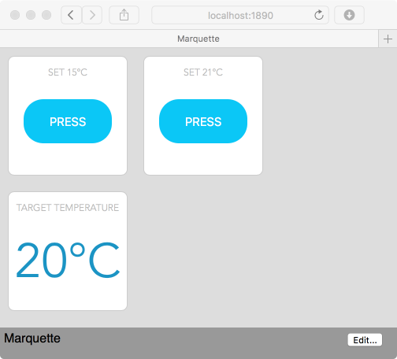

Marquette
=========

Web browser based Control Panel that can publish and subscribe to MQTT messages.


## Features

 - Resizable tile based control panel
 - Messages received by browser using [Server-Sent Events](https://www.w3.org/TR/eventsource/)
 - Messages sent from browser using HTTP POST


## Install

```
git clone https://github.com/njh/marquette.git
npm install
```


## Usage

1. Edit `settings.js` to point to your MQTT server
2. Edit `tiles.json` to configure your buttons and display text
3. Run `npm start` to start the web server
4. Open http://localhost:1890/ in you local web browser


## Screenshot




## Limitations

* Only 'Push Button' and 'Text' tiles currently supported
* In-browser configuration not implemented
* Styling improvements needed


## Author

Nicholas Humfrey ([@njh](https://twitter.com/njh))


## License

 - **Apache 2.0** : https://opensource.org/licenses/Apache-2.0
